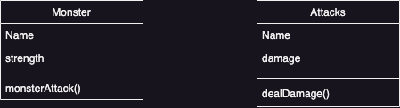

# Tutorial 6: Constructor Functions & Class Notation

In this tutorial, you are going to practice working with constructor functions and class notations to recreate a script written using plain objects, to implement the design shown in the image below.

While the class notation provides a better organization of the code, the constructor function provides a good enough mechanism to resemble the class creation and object instantiation concepts of the object-oriented paradigm so that we can benefit from the object-oriented design principles and patterns that are widely accepted as solutions for common problems.

You're going to learn more about OOD principles & patterns in other courses; however, just to establish the connection, take the ability to use the UML class diagram below as one of the benefits that the object-oriented paradigm provides.

As you can see in the diagram, we have two concepts, 'Monster' and  'Attack'; each of them has methods and attributes/ properties. The file named 'plainObjects.js' implements the given design using plain objects. As you can see, it's not the best way to organize the code; for example, the functions are defined separately with certain objects in mind, and there is duplication in using creating similar properties, which could be error-prone. You will also notice that the functions getStrength and getDamaged are using the "call" function. Those functions are not part of the objects themselves.

## Task 1: Using Constructor Functions

In the file 'constructorFunctions.js', create two constructor functions for the two concepts 'Monster' and 'Attack' and re-organize the code in plainObjects.js so that the objects are created using the constructor functions and the script prints the same output of plainObject.js. You do not need to modify the code inside of any functions. You should add the function getDamaged and getStrength to the Monster's prototype. You will then be able to call the function from the object. HINT the second parameter of call is the arguments you pass into the function. 

## Task 2: Using the Class Notation

In the file named 'classNotation.js' re-organize the code again to use the class notation and give the same output. getDamaged and getStrength should still be part of the function's prototype. 

